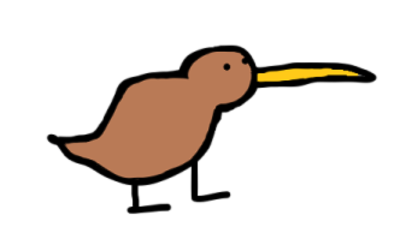

<!-- Improved compatibility of back to top link: See: https://github.com/othneildrew/Best-README-Template/pull/73 -->
<a name="readme-top"></a>
<!--
*** Thanks for checking out the Best-README-Template. If you have a suggestion
*** that would make this better, please fork the repo and create a pull request
*** or simply open an issue with the tag "enhancement".
*** Don't forget to give the project a star!
*** Thanks again! Now go create something AMAZING! :D
-->


<!-- PROJECT SHIELDS -->
<!--
*** I'm using markdown "reference style" links for readability.
*** Reference links are enclosed in brackets [ ] instead of parentheses ( ).
*** See the bottom of this document for the declaration of the reference variables
*** for contributors-url, forks-url, etc. This is an optional, concise syntax you may use.
*** https://www.markdownguide.org/basic-syntax/#reference-style-links
-->
[![Contributors][contributors-shield]][contributors-url]
[![Forks][forks-shield]][forks-url]
[![Stargazers][stars-shield]][stars-url]
[![Issues][issues-shield]][issues-url]
[![MIT License][license-shield]][license-url]
[![LinkedIn][linkedin-shield]][linkedin-url]


<!-- PROJECT LOGO -->
<br />
<div align="center">
  <a href="https://github.com/yangela1/LingoBot">
    
  </a>

<h3 align="center">LingoBot</h3>

  <p align="center">
    A simple Discord bot developed using Python which features a word guessing game complete with fun challenges, rewards, and general commands.
    <br />
    <a href="https://discordpy.readthedocs.io/en/stable/index.html"><strong>Explore the discord.py docs »</strong></a>
    <br />
    <br />

[//]: # (    <a href="https://github.com/github_username/repo_name">View Demo</a>)

[//]: # (    ·)

[//]: # (    <a href="https://github.com/github_username/repo_name/issues">Report Bug</a>)

[//]: # (    ·)

[//]: # (    <a href="https://github.com/github_username/repo_name/issues">Request Feature</a>)
  </p>
</div>


<!-- TABLE OF CONTENTS -->
<details>
  <summary>Table of Contents</summary>
  <ol>
    <li>
      <a href="#about-the-project">About The Project</a>
    </li>
    <li>
      <a href="#getting-started">Getting Started</a>
      <ul>
        <li><a href="#prerequisites">Prerequisites</a></li>
        <li><a href="#installation">Installation</a></li>
      </ul>
    </li>
    <li><a href="#usage">Usage</a></li>
    <li><a href="#roadmap">Roadmap</a></li>
    <li><a href="#contributing">Contributing</a></li>
    <li><a href="#license">License</a></li>
    <li><a href="#contact">Contact</a></li>
    <li><a href="#acknowledgments">Acknowledgments</a></li>
  </ol>
</details>


<!-- ABOUT THE PROJECT -->

## About The Project

[![Product Name Screen Shot][product-screenshot]](https://example.com)

LingoBot is developed using Python and the `discord.py` library. Drawing inspiration from Duolingo, I aimed to create a
tool that makes learning new words effortless and enjoyable, all within an environment many of us already use
daily—Discord. This integration eliminates the need to switch between applications, making it a convenient leisurely
learning tool.
LingoBot combines the elements of a word-guessing game with the utility of a language learning app. The game allows
players to earn coins and buy items in a virtual shop, while also encouraging friendly competition through a server-wide
leaderboard and a
reward system. Game statistics and the vocabulary each player learns is stored in MongoDB.
Several APIs are used to fetch words, their definitions, and images corresponding to the words including Vercel,
Rapidapi, and Pexels.
This project is my first bot utilizing the `discord.ext.commands.Bot` class, and it operates with the traditional
command prefix '$' without Slash commands.

<p align="right">(<a href="#readme-top">back to top</a>)</p>


<!-- GETTING STARTED -->

## Getting Started

First make sure you have all the tokens listed below to interact with the APIs.

### Prerequisites

#### Required tokens:

* [Discord API](https://discord.com/developers/applications)
* [MongoDB](https://www.mongodb.com/atlas/database)
    * user
    * password
    * connection string
    * database
* [Rapid API](https://rapidapi.com/hub)
* [Pexels](https://www.pexels.com/license/)

#### Required permissions:

Make sure your bot has the following permissions: `application.commands` scope enabled found under the `Installation`tab
in the [developer portal](https://discord.com/developers/applications/).

Enable the `Presence Intent`, `Server Members Intents` and `Message Content Intent` which can be found under the `Bot`
tab.

### Installation

1. Clone the repository

```bash 
git clone https://github.com/yangela1/LingoBot.git
```

2. Open up the project in your preferred IDE.
3. Create a `.env` file in the root directory of the project and copy the provided keys into it,
   replacing `INSERT_YOUR_X_HERE` with your actual tokens. 

```python
DISCORD_TOKEN = "INSERT_YOUR_TOKEN_HERE"
MONGO_HOST = "INSERT_YOUR_TOKEN_HERE"
MONGO_USER = "INSERT_YOUR_USER_HERE"
MONGO_PASSWORD = "INSERT_YOUR_PASSWORD_HERE"
DATABASE = "INSERT_YOUR_DATABASE_NAME_HERE"
PEXELS_KEY = "INSERT_YOUR_TOKEN_HERE"
X_RAPIDAPIKEY = "INSERT_YOUR_TOKEN_HERE"
X_RAPIDHOST_WORDS = "wordsapiv1.p.rapidapi.com"
X_RAPIDHOST_TRANSLATE = "google-translate113.p.rapidapi.com"
```
4. Install the following dependencies:

```bash
$ pip install discord.py pymongo dotenv requests
```
5. Run the application and the bot will come online.

```bash
$ python3 main.py
```

<p align="right">(<a href="#readme-top">back to top</a>)</p>


<!-- USAGE EXAMPLES -->

## Features & Commands

Use this space to show useful examples of how a project can be used. Additional screenshots, code examples and demos
work well in this space. You may also link to more resources.

_For more examples, please refer to the [Documentation](https://example.com)_

<p align="right">(<a href="#readme-top">back to top</a>)</p>


<!-- ROADMAP -->

## Roadmap

- [ ] Feature 1
- [ ] Feature 2
- [ ] Feature 3
    - [ ] Nested Feature

See the [open issues](https://github.com/github_username/repo_name/issues) for a full list of proposed features (and
known issues).

<p align="right">(<a href="#readme-top">back to top</a>)</p>


<!-- CONTRIBUTING -->

## Contributing

Contributions are what make the open source community such an amazing place to learn, inspire, and create. Any
contributions you make are **greatly appreciated**.

If you have a suggestion that would make this better, please fork the repo and create a pull request. You can also
simply open an issue with the tag "enhancement".
Don't forget to give the project a star! Thanks again!

1. Fork the Project
2. Create your Feature Branch (`git checkout -b feature/AmazingFeature`)
3. Commit your Changes (`git commit -m 'Add some AmazingFeature'`)
4. Push to the Branch (`git push origin feature/AmazingFeature`)
5. Open a Pull Request

<p align="right">(<a href="#readme-top">back to top</a>)</p>


<!-- LICENSE -->

## License

Distributed under the MIT License. See `LICENSE.txt` for more information.

<p align="right">(<a href="#readme-top">back to top</a>)</p>


<!-- CONTACT -->

## Contact

Your Name - [@twitter_handle](https://twitter.com/twitter_handle) - email@email_client.com

Project Link: [https://github.com/github_username/repo_name](https://github.com/github_username/repo_name)

<p align="right">(<a href="#readme-top">back to top</a>)</p>


<!-- ACKNOWLEDGMENTS -->

## Acknowledgments

* []()
* []()
* []()

<p align="right">(<a href="#readme-top">back to top</a>)</p>


<!-- MARKDOWN LINKS & IMAGES -->
<!-- https://www.markdownguide.org/basic-syntax/#reference-style-links -->

[contributors-shield]: https://img.shields.io/github/contributors/github_username/repo_name.svg?style=for-the-badge

[contributors-url]: https://github.com/github_username/repo_name/graphs/contributors

[forks-shield]: https://img.shields.io/github/forks/github_username/repo_name.svg?style=for-the-badge

[forks-url]: https://github.com/github_username/repo_name/network/members

[stars-shield]: https://img.shields.io/github/stars/github_username/repo_name.svg?style=for-the-badge

[stars-url]: https://github.com/github_username/repo_name/stargazers

[issues-shield]: https://img.shields.io/github/issues/github_username/repo_name.svg?style=for-the-badge

[issues-url]: https://github.com/github_username/repo_name/issues

[license-shield]: https://img.shields.io/github/license/github_username/repo_name.svg?style=for-the-badge

[license-url]: https://github.com/github_username/repo_name/blob/master/LICENSE.txt

[linkedin-shield]: https://img.shields.io/badge/-LinkedIn-black.svg?style=for-the-badge&logo=linkedin&colorB=555

[linkedin-url]: https://linkedin.com/in/linkedin_username

[product-screenshot]: images/screenshot.png

[Next.js]: https://img.shields.io/badge/next.js-000000?style=for-the-badge&logo=nextdotjs&logoColor=white

[Next-url]: https://nextjs.org/

[React.js]: https://img.shields.io/badge/React-20232A?style=for-the-badge&logo=react&logoColor=61DAFB

[React-url]: https://reactjs.org/

[Vue.js]: https://img.shields.io/badge/Vue.js-35495E?style=for-the-badge&logo=vuedotjs&logoColor=4FC08D

[Vue-url]: https://vuejs.org/

[Angular.io]: https://img.shields.io/badge/Angular-DD0031?style=for-the-badge&logo=angular&logoColor=white

[Angular-url]: https://angular.io/

[Svelte.dev]: https://img.shields.io/badge/Svelte-4A4A55?style=for-the-badge&logo=svelte&logoColor=FF3E00

[Svelte-url]: https://svelte.dev/

[Laravel.com]: https://img.shields.io/badge/Laravel-FF2D20?style=for-the-badge&logo=laravel&logoColor=white

[Laravel-url]: https://laravel.com

[Bootstrap.com]: https://img.shields.io/badge/Bootstrap-563D7C?style=for-the-badge&logo=bootstrap&logoColor=white

[Bootstrap-url]: https://getbootstrap.com

[JQuery.com]: https://img.shields.io/badge/jQuery-0769AD?style=for-the-badge&logo=jquery&logoColor=white

[JQuery-url]: https://jquery.com 