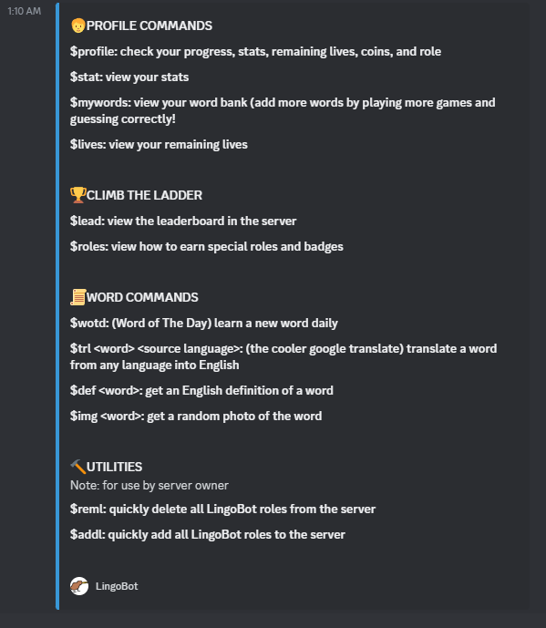

<!-- Improved compatibility of back to top link: See: https://github.com/othneildrew/Best-README-Template/pull/73 -->
<a name="readme-top"></a>
<!--
*** Thanks for checking out the Best-README-Template. If you have a suggestion
*** that would make this better, please fork the repo and create a pull request
*** or simply open an issue with the tag "enhancement".
*** Don't forget to give the project a star!
*** Thanks again! Now go create something AMAZING! :D
-->


<!-- PROJECT SHIELDS -->
<!--
*** I'm using markdown "reference style" links for readability.
*** Reference links are enclosed in brackets [ ] instead of parentheses ( ).
*** See the bottom of this document for the declaration of the reference variables
*** for contributors-url, forks-url, etc. This is an optional, concise syntax you may use.
*** https://www.markdownguide.org/basic-syntax/#reference-style-links
-->

<!-- PROJECT LOGO -->
<br />
<div align="center">
  <a href="https://github.com/yangela1/LingoBot">
    
  </a>

<h3 align="center">LingoBot</h3>

  <p align="center">
    A simple Discord bot developed using Python, featuring a word guessing game complete with fun challenges,
    rewards, and utilities such as a word translator.
    <br />
    <a href="https://discordpy.readthedocs.io/en/stable/index.html"><strong>Explore the discord.py docs »</strong></a>
    <br />
    <br />

[//]: # (    <a href="https://github.com/github_username/repo_name">View Demo</a>)

[//]: # (    ·)

[//]: # (    <a href="https://github.com/github_username/repo_name/issues">Report Bug</a>)

[//]: # (    ·)

[//]: # (    <a href="https://github.com/github_username/repo_name/issues">Request Feature</a>)
  </p>
</div>


<!-- TABLE OF CONTENTS -->
<details>
  <summary>Table of Contents</summary>
  <ol>
    <li>
      <a href="#about-the-project">About The Project</a>
    </li>
    <li>
      <a href="#getting-started">Getting Started</a>
      <ul>
        <li><a href="#prerequisites">Prerequisites</a></li>
        <li><a href="#installation">Installation</a></li>
      </ul>
    </li>
    <li><a href="#features-and-commands">Features and Commands</a></li>
    <li><a href="#roadmap">Roadmap</a></li>
    <li><a href="#contributing">Contributing</a></li>
    <li><a href="#author">Author</a></li>
    <li><a href="#acknowledgments">Acknowledgments</a></li>
    <li><a href="#license">License</a></li>
  </ol>
</details>


<!-- ABOUT THE PROJECT -->

## About The Project


LingoBot is developed using Python and the `discord.py` library. Drawing inspiration from Duolingo, I aimed to create a
tool that makes learning new words effortless and enjoyable, all within an environment many of us already use
daily—Discord. This integration eliminates the need to switch between applications, making it a convenient leisurely
learning tool.
LingoBot combines the elements of a word-guessing game with the utility of a language learning app. The game allows
players to earn coins and buy items in a virtual shop, while also encouraging friendly competition through a server-wide
leaderboard and a reward system. Game statistics and the vocabulary each player learns are stored in MongoDB.

Several APIs are used to fetch words, their definitions, and images corresponding to the words including Vercel,
RapidAPI, and Pexels.

This project is my first bot utilizing the `discord.ext.commands.Bot` class, and it operates with the traditional
command prefix '$' without Slash commands.

<p align="right">(<a href="#readme-top">back to top</a>)</p>


<!-- GETTING STARTED -->

## Getting Started

First make sure you have all the tokens listed below to interact with the APIs.

### Prerequisites

#### Required tokens:

* [Discord API](https://discord.com/developers/applications)
* [MongoDB](https://www.mongodb.com/atlas/database)
    * user
    * password
    * connection string
    * database
* [Rapid API](https://rapidapi.com/hub)
* [Pexels](https://www.pexels.com/license/)

#### Required permissions:

Make sure your bot has the following permissions: `application.commands` scope enabled found under the `Installation`tab
in the [developer portal](https://discord.com/developers/applications/).

Enable the `Presence Intent`, `Server Members Intents` and `Message Content Intent` which can be found under the `Bot`
tab.

### Database configuration:

1. Create the Database:

* Use a cloud MongoDB service like MongoDB Atlas or have MongoDB installed and running on your machine
* Create a new database for your Discord Bot in the MongoDB shell or the MongoDB Atlas dashboard

2. Create Collections:

* In your database, create three collections: `users`, `words`, and `word_of_the_day`
    * `users` collection stores user data organized by unique Discord Server IDs for each document. Within the `users`
      object field, it contains many `id` objects, each representing a user in the server. The `id` key is represented
      by the unique Discord ID (Number) of each user. Each `id` object has its own details, including the user's unique
      Discord ID, Discord name, hearts, coins, words learned in different languages, wrong words guessed, number of
      correct guesses, number of incorrect guesses, and number of challenges completed.
    * `words` collection stores data on the words including their definition. The `Translation_language` key represents
      the language to which the word is translated. This field exists in the document and stored only during Challenge
      mode play. The value of `Translation_language` is the translation of the word in the specified language.
    * `word_of_the_day` collection stores the current word of the day with their definition and date in the format
      YYYY-MM-DD.
  > Note: the keys represented by languages are capitalized.
* Database schemas
    * Here's the database schema for the `users` collection in a JSON representation:

```json
{
  "_id": "ObjectId",
  "guild_id": "Number",
  "users": {
    "id": {
      "discord_id": "Number",
      "name": "String",
      "hearts": "Number",
      "coins": "Number",
      "words_learned": {
        "English": [],
        "Spanish": [],
        "French": [],
        "German": [],
        "Italian": [],
        "Swedish": []
      },
      "wrong_words": [],
      "correct_guess": "Number",
      "incorrect_guess": "Number",
      "chal_complete": "Number"
    }
  }
}
```

* Here's the database schema for the `words` collection:

```json
{
  "_id": "ObjectId",
  "word": "String",
  "definition": "String",
  "Translation_language": "String"
}
```

* Here's the database schema for the `word_of_the_day` collection:

```json
{
  "_id": "ObjectId",
  "word": "String",
  "definition": "String",
  "date": "String"
}
```

### Installation

1. Clone the repository:

```bash 
$ git clone https://github.com/yangela1/LingoBot.git
```

2. Open up the project in your preferred IDE.
3. Create a `.env` file in the root directory of the project and copy the provided keys into it,
   replacing `INSERT_YOUR_X_HERE` with your actual tokens.

```python
DISCORD_TOKEN = "INSERT_YOUR_TOKEN_HERE"
MONGO_HOST = "INSERT_YOUR_TOKEN_HERE"
MONGO_USER = "INSERT_YOUR_USER_HERE"
MONGO_PASSWORD = "INSERT_YOUR_PASSWORD_HERE"
DATABASE = "INSERT_YOUR_DATABASE_NAME_HERE"
PEXELS_KEY = "INSERT_YOUR_TOKEN_HERE"
X_RAPIDAPIKEY = "INSERT_YOUR_TOKEN_HERE"
X_RAPIDHOST_WORDS = "wordsapiv1.p.rapidapi.com"
X_RAPIDHOST_TRANSLATE = "google-translate113.p.rapidapi.com"
```

4. Install the following dependencies:

```bash
$ pip install discord.py pymongo dotenv requests
```

5. Run the application and the bot will come online.

```bash
$ python3 main.py
```

<p align="right">(<a href="#readme-top">back to top</a>)</p>


<!-- FEATURES EXAMPLES -->

## Features and Commands

_Help commands_

* [Help](#help)
* [Currency Guide](#currency-guide)

_Play commands_

* [Play](#play)
    * [Rewards Information](#gameplay-and-rewards-information)

_Shop commands_

* [Hints](#hints)
* [Passes](#passes)
* [Buying Lives](#buy-lives)
* [Gambling](#gamble)

_Profile commands_

* [Lives](#lives)
* [Profile](#profile)
* [Stats](#stats)
* [My Words](#my-words)

_Reward System commands_

* [Leaderboard](#leaderboard)
* [Roles](#roles)

_Word commands_

* [Word of the Day](#word-of-the-day)
* [Translator tool](#translate)
* [Dictionary tool](#dictionary)
* [Image tool](#image)

_Admin commands_

* [Add LingoBot roles](#add-roles)
* [Remove LingoBot roles](#remove-roles)

### ❓ Help

The help reply is sent to your DMs.

The message provides a detailed list of commands you can use for the bot.

```$help```


 

### 💰 Currency Guide

The help reply is sent to the channel.

When you play games, you earn currencies called 'kiwis'. There are two types of kiwis available: green kiwis and gold
kiwis. Each game mode awards a different amount of currency. Details about the shop commands and the costs of items are
also provided.

```$k```


<p align="right">(<a href="#readme-top">back to top</a>)</p>

### 🎮 Play

Play the word guessing game. There are three game modes: normal, hard, and easy.

🟠 **Normal mode**: Guess the translation of an English word.

```$play```


🔴 **Hard mode**: Guess the translation of a word in one of these languages (Spanish, French, German, Italian, Swedish).

```$chal```


🟢 **Easy mode**: Guess the translation of an English word you've previously guessed incorrectly.

```$requiz```


### 🏁 Gameplay and Rewards Information

LingoBot provides feedback on your chosen answer. Your game statistics are updated after each guess and the new word is
also stored to the database.

In the `users` Collection:

* Correctly guessed words are stored in the words_learned field in MongoDB.
* Incorrectly guessed words are stored in the wrong_words field in MongoDB.
* A correct answer for $requiz updates both word banks.

In the `words` Collection:

* The word is stored along with its definition and/or translation.

<u>🎉If you win</u>:

* in Easy mode ($requiz): earn green kiwis
* in Normal mode ($play): earn green kiwis
* in Hard ($chal): earn green kiwis and gold kiwis

<u>💔If you lose or timeout</u>:

* in all modes: no kiwis are earned and you lose a life
 
<p align="right">(<a href="#readme-top">back to top</a>)</p>

### 🔍 Hints

Buying a hint costs a certain amount of kiwis depending on the game mode. A synonym of the word is given.
> Note: Hints are unable to be used in the easy game mode (`$requiz`).

```$hint```


### ⏩ Pass

Buying a pass costs a certain amount of kiwis depending on the game mode. A pass will skip the current word without any
penalties and start a new game of the same mode.
> Note: Passes are unable to be used in the easy game mode (`$requiz`).

```$pass```


### ❤ Buy Lives

Buying a life costs a gold kiwi. Lives regenerate over time and the maximum amount of lives you can have at any time is
three.

```$buylife```


### 🎰 Gamble

Gambles any amount you wish that you have in your storage. Green kiwis are won or lost.

```$gamble <amount>```


<p align="right">(<a href="#readme-top">back to top</a>)</p>

### 💖 Lives

View your remaining lives. 

```$lives```


### 👤 Profile

Check your progress, lives, coins earned, stats, and special badges earned.

```$profile``` 

For example, I have the role of `Lingo Einstein` so I have the badge on my profile.


### 📊 Stats

View your stats.

```$stat```


### 📚 My Words

View the vocabulary you guessed correctly in the word bank.

```$mywords```


<p align="right">(<a href="#readme-top">back to top</a>)</p>

### 🏆 Leaderboard

View the leaderboard in the current server. 

```$lead```


### 🎭 Roles

View how to earn special roles and badges. Scores are stored server wide.

```$roles```


For example, I have the role of `Lingo Einstein` within the server.


<p align="right">(<a href="#readme-top">back to top</a>)</p>

### 📅 Word of the Day

Learn a new word daily. The given word is also stored in the user's word bank. 

```$wotd```


### 🌐 Translate

Translate a word (or sentence) from any language into the English translation. 

```$trl <word(s) to translate> <source language>``` 

For example, I asked to translate 'hi how is your day' from Hungarian.


### 📖 Dictionary

Get an English definition of a word.

```$def <word>```


### 🖼️ Image

Get a random photo representation of a word.

```$img <word>```


### ➕ Add Roles

Quickly add all LingoBot roles to the server (use if roles are deleted by accident, etc.).

```$addl```


### ➖ Remove Roles

Quickly remove all LingoBot roles from the server (use if you want to remove the Bot from the server or certain roles).

```$removel```


<p align="right">(<a href="#readme-top">back to top</a>)</p>


<!-- ROADMAP -->

## Roadmap

- [ ] Refactoring code [in-progress] 
- [ ] Add pins that players can buy to display on the profile
- [ ] Incorporate use of slash commands
- [ ] Pronunciation guide 

See the [open issues](https://github.com/github_username/repo_name/issues) for a full list of proposed features (and
known issues).

<p align="right">(<a href="#readme-top">back to top</a>)</p>


<!-- CONTRIBUTING -->

## Contributing

Any contributions you make are **greatly appreciated**!

If you have a suggestion that would make this better, please fork the repo and create a pull request. You can also
simply open an issue with the tag "enhancement".
Don't forget to give the project a star! Thanks again!

1. Fork the Project
2. Create your Feature Branch (`git checkout -b feature/AmazingFeature`)
3. Commit your Changes (`git commit -m 'Add some AmazingFeature'`)
4. Push to the Branch (`git push origin feature/AmazingFeature`)
5. Open a Pull Request

<p align="right">(<a href="#readme-top">back to top</a>)</p>


<!-- Author -->

## Author

Angela Yu - `angelayu8800@gmail.com`, [LinkedIn](http://linkedin.com/in/angela-yu99)


<p align="right">(<a href="#readme-top">back to top</a>)</p>


<!-- ACKNOWLEDGMENTS -->

## Acknowledgments

* [Mudae Bot](https://top.gg/bot/432610292342587392)


<p align="right">(<a href="#readme-top">back to top</a>)</p>


<!-- LICENSE -->

## License

Distributed under the MIT License. See `LICENSE.txt` for more information.

<p align="right">(<a href="#readme-top">back to top</a>)</p>


<!-- MARKDOWN LINKS & IMAGES -->
<!-- https://www.markdownguide.org/basic-syntax/#reference-style-links -->

